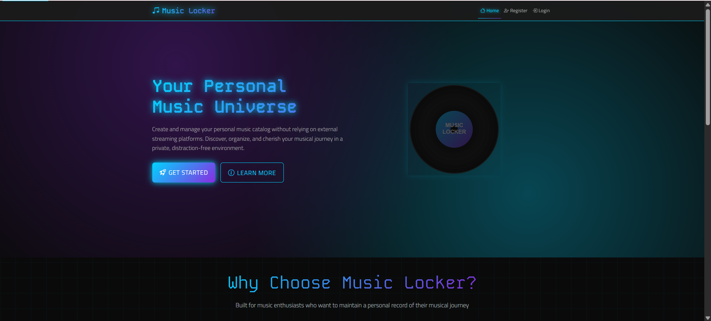
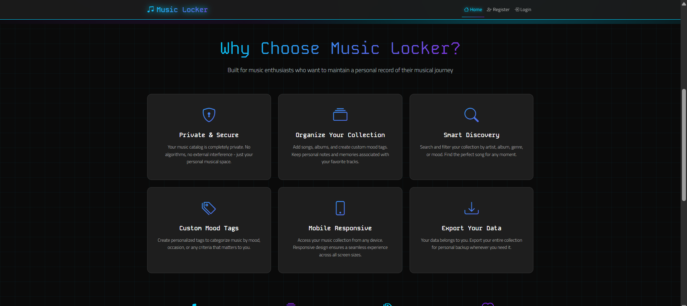
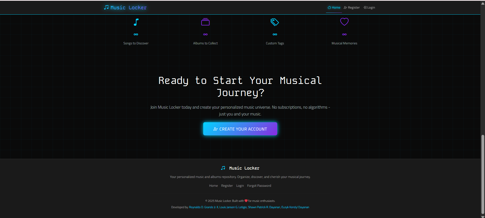
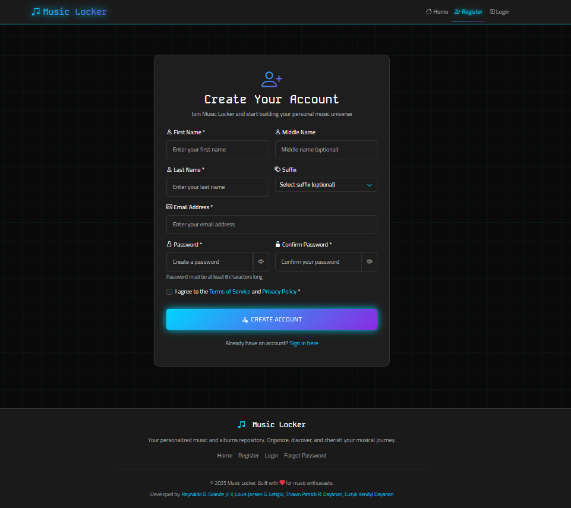
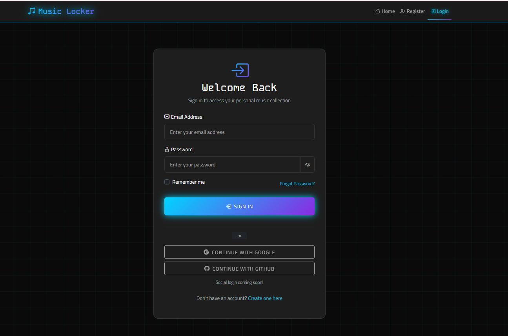
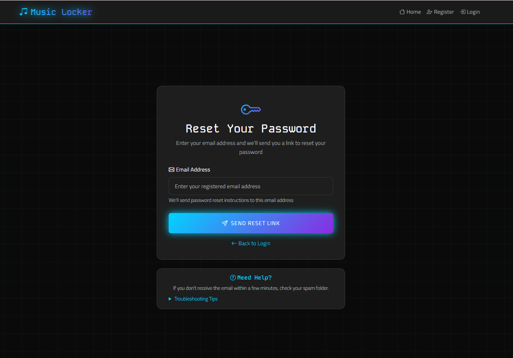

# Music Locker - Bootstrap 

## 🎵 Project Overview

Music Locker is a PHP-based web application that allows users to create and manage their personal music catalog without relying on external streaming platforms. This provides a beautiful, responsive interface for users to organize their musical journey in a private, distraction-free environment.

## 👥 Group Members

**Team NaturalStupidity**

- **Reynaldo D. Grande Jr. II** - [Facebook](https://www.facebook.com/reyyyy.naldooo)
- **Louis Jansen G. Letigio** - [Facebook](https://www.facebook.com/louis.jansen.letigio.2024)
- **Shawn Patrick R. Dayanan** - [Facebook](https://www.facebook.com/shawn.dayanan)
- **Euzyk Kendyl Dayanan** - [Facebook](https://www.facebook.com/uzyx2)

## 📱 Screenshots

### Homepage (index.html)

*Hero section with vinyl record animation and call-to-action buttons*


*Features showcase with glowing cards and neon accents*


*Statistics section and final call-to-action for registration*

### Registration Page (register.html)

*Comprehensive registration form with all required fields including name, email, password, and terms acceptance*

### Login Page (login.html)

*User authentication form with email/password fields, remember me option, and social login placeholders*

### Forgot Password Page (forgot.html)

*Password reset form with helpful instructions and troubleshooting tips*

## 🌐 Live Demo

**GitHub Pages URL**: [Coming Soon](#)

> **Note**: GitHub Pages demo will be available once the repository is pushed to GitHub and configured.


## 🛠️ Technologies Used

- **Bootstrap 5.3.2**: CSS framework via CDN
- **Bootstrap Icons**: Icon library
- **Google Fonts**: Kode Mono & Titillium Web
- **Custom CSS**: Dark techno theme with neon accents
- **Vanilla JavaScript**: Form validation and interactive features

## 📁 File Structure

```
music-locker-bootstrap/
├── assets/
│   ├── css/
│   │   └── dark-techno-theme.css
│   └── img/
│       ├── music-note.svg
│       └── vinyl-record.svg
├── screenshots/          # Add your screenshots here
├── index.html
├── register.html
├── login.html
├── forgot.html
└── README.md
```


## 📱 Responsiveness Testing

To test mobile responsiveness:

1. **Open in browser** and press `F12` for DevTools
2. **Click the device icon** (📱) to enter mobile view
3. **Select device presets** (iPhone, iPad, etc.)
4. **Test different orientations** and screen sizes


---

**Built with ❤️ for music enthusiasts using Bootstrap 5 and modern web standards.**

*Last updated: August 17, 2025*
